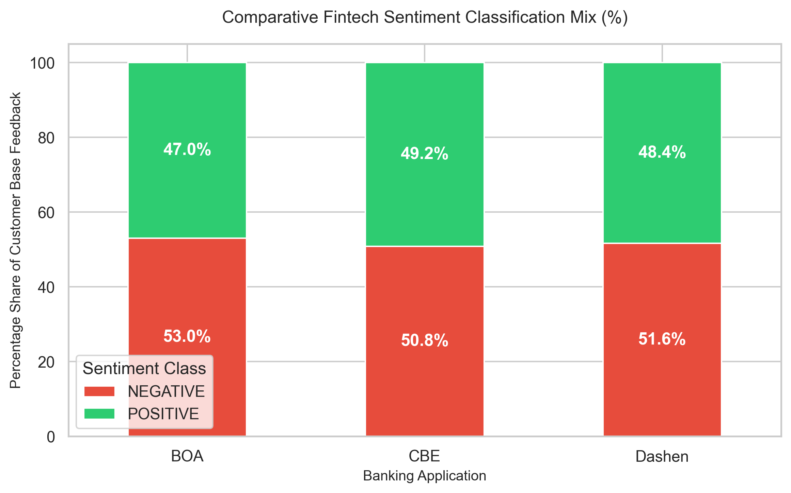

# Fintech Review Analytics

An end-to-end data engineering and sentiment analysis pipeline designed to extract, clean, and analyze user reviews for major Ethiopian banking mobile applications (CBE, Bank of Abyssinia, and Dashen Bank). This project is developed as part of the Kifya training program.

## 📁 Project Structure

```text
fintech-review-analytics/
├── .vscode/
│   └── settings.json
├── .github/
│   └── workflows/
│       └── unittests.yml
├── .gitignore
├── requirements.txt
├── README.md
├── data/
│   ├── raw/                  # Raw scraped dataset (git-ignored)
│   └── processed/            # Processed datasets with sentiment labels (git-ignored)
├── notebooks/                # Notebooks and generated report visualizations
│   ├── __init__.py
│   ├── README.md
│   └── sentiment_distribution.png
├── src/
│   └── __init__.py
├── tests/
│   └── __init__.py
└── scripts/                  # Modular execution scripts
    ├── __init__.py
    ├── README.md
    ├── collect_data.py       # Task 1: Scraper & Preprocessing pipeline
    ├── analyze_sentiment.py  # Task 2: DistilBERT Sentiment analysis
    └── generate_charts.py    # Visualizations generator

   ```
  ## 🛠️ Setup and Installation
   
1. ## Clone the repository:
   ```bash
git clone [https://github.com/Solih06/fintech-review-analytics.git](https://github.com/Solih06/fintech-review-analytics.git)
cd fintech-review-analytics
   
2. ## Set up Virtual Environment
   On Windows Powershell/CMD
   ```bash
   python -m venv venv
   .\venv\Scripts\activate
   ```
3. ## Install dependencies
   ```bash
   pip install -r requirements.txt
   ```
## 🚀 Execution Pipeline

The project pipeline is split into distinct, modular scripts executed in the following order:
## Step 1: Data Collection & Preprocessing

Extracts user reviews from Google Play Store for CBE, BOA, and Dashen apps, deduplicates data based on unique review IDs, standardizes schemas, and normalizes date ranges.
 ```bash
 python scripts/collect_data.py
  ```
## Step 2: Sentiment Classification (Task 2)

Leverages the Hugging Face Transformers pipeline loaded with a fine-tuned distilbert-base-uncased-finetuned-sst-2-english model to automatically append sentiment classifications and model confidence scores to the raw reviews.
  ```bash
  python scripts/analyze_sentiment.py
  ```
## Step 3: Visualization Generation

Aggregates the processed metrics and exports analytical plots reflecting cross-platform sentiment trends
  ```bash
  python scripts/generate_charts.py
  ```
## 💻 Core Technologies

    Language & Automation: Python 3.13

    Data Processing: Pandas, NumPy

    Machine Learning: Hugging Face (Transformers), PyTorch

    Data Visualization: Matplotlib, Seaborn

## 📊 Visualizations
Sentiment Distribution across Fintech Apps
The following chart shows the comparative breakdown of user sentiment across the evaluated banking applications (CBE, BOA, and Dashen Bank) using 1,500 processed reviews:

