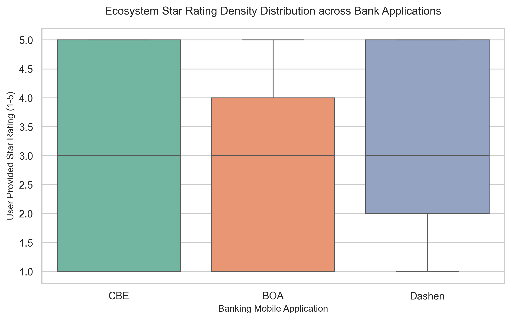
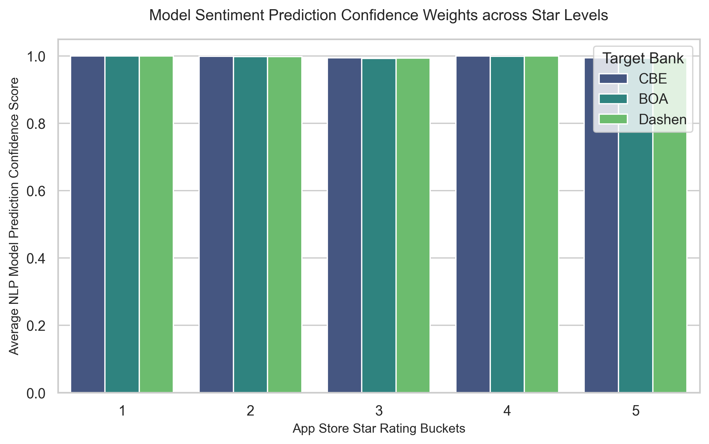

# Fintech Review Analytics

An end-to-end data engineering, natural language processing (NLP), and relational database pipeline designed to extract, clean, analyze, and securely store user reviews for major Ethiopian banking mobile applications (CBE, Bank of Abyssinia, and Dashen Bank). This project is developed under the role of a Data Analyst at Omega Consultancy as part of the Kifya training program.

## 📁 Project Structure

```text
fintech-review-analytics/
├── .vscode/
│   └── settings.json
├── .github/
│   └── workflows/
│       └── unittests.yml
├── .gitignore                  # Active security exclusions (ignores local config files)
├── requirements.txt            # System dependency manifest
├── README.md                   # Technical documentation manual
├── schema.sql                  # Relational DB Layout & Integrity Verification Queries
├── .env.example                # Protected Environment Configuration Template
├── data/
│   ├── raw/                    # Raw scraped dataset (git-ignored)
│   └── processed/              # Processed datasets with sentiment labels & extracted themes
│       ├── sentiment_results.csv
│       └── thematic_trends.csv
├── notebooks/                  # Notebooks and generated report visualizations
│   ├── __init__.py
│   ├── README.md
│   ├── sentiment_distribution.png
│   ├── rating_distribution_boxplot.png
│   └── sentiment_confidence_vs_rating.png
├── src/
│   └── __init__.py
├── tests/
│   └── __init__.py
└── scripts/                    # Modular automation engineering runfiles
    ├── __init__.py
    ├── README.md
    ├── collect_data.py         # Task 1: Scraper & Preprocessing pipeline
    ├── analyze_sentiment.py    # Task 2: DistilBERT Sentiment & Thematic analysis
    ├── insert_data.py          # Task 3: PostgreSQL Secure Ingestion Pipe
    └── generate_insights.py    # Task 4: Seaborn Stakeholder Visual Planner
   ```
   
## 🛠️ Setup and Installation

1. **Clone the repository:**
   ```bash
   git clone [https://github.com/Solih06/fintech-review-analytics.git](https://github.com/Solih06/fintech-review-analytics.git)
   cd fintech-review-analytics
   ```
2. **Set up Virtual Environment (On Windows PowerShell/CMD):** 
   ```bash
  python -m venv venv
  .\venv\Scripts\activate
   ```
  
3. **Install dependencies:**
   ```bash
   pip install -r requirements.txt
   ```

## 🔒 Security Compliance & Environment Setup

Now that your environment dependencies are installed, you must configure your local access credentials. In strict compliance with professional software engineering practices, no local database clusters, user credentials, or server passwords are hardcoded inside the repository source files. Private tokens are fully abstracted using runtime environment parameters.

To run or grade the database ingestion layer, mirror the configuration pattern detailed below:

1. Generate your local configuration file by duplicating the public template:
   ```bash
   cp .env.example .env
2. Open the newly created .env file and replace the filler text with your local PostgreSQL server password:
   ```bash
   DB_PASSWORD=your_actual_postgres_password_here

## 🚀 Execution Pipeline

The project pipeline is split into distinct, modular scripts executed in the following order:
**Step 1: Data Collection & Preprocessing (Task 1)**

Extracts user reviews from Google Play Store for CBE, BOA, and Dashen apps, deduplicates data based on unique review IDs, standardizes schemas, and normalizes date ranges.
   ```bash
   python scripts/collect_data.py
   ```
**Step 2: Full-Scale Sentiment & Thematic Analytics (Task 2)**

Leverages the Hugging Face Transformers pipeline loaded with a fine-tuned distilbert-base-uncased-finetuned-sst-2-english model to automatically append sentiment classifications and model confidence scores to the raw reviews across the entire 1,500 review dataset. It then tokenizes, filters stop-words, and calculates a frequency distribution to map key technical customer complaints.
  ```bash
  python scripts/analyze_sentiment.py
  ```
**Step 3: Relational Database Migration & Automated Ingestion (Task 3)**

Builds the relational tables layout in PostgreSQL, maps database schema structural parameters out of schema.sql, securely reads local environment credentials, and batch-inserts all 1,500 processed entries using optimized psycopg2 batch execution structures.
  ```bash
  python scripts/insert_data.py
  ```
**Step 4: Executive Insights Visualization (Task 4)**

Aggregates metrics directly from the processed datasets using Matplotlib and Seaborn, compiling a matrix of publication-quality data graphics saved directly into the notebooks/ directory for final stakeholder briefings.
  ```bash
  python scripts/generate_insights.py
  ```
## 🗄️ Relational Database Schema Design (Task 3)

The analytical environment transitions flat-file outputs into a structured, relational PostgreSQL database container named bank_reviews. The data architecture relies on rigid foreign key constraints and validation rules defined inside schema.sql:

    banks (Lookup Dimensions Table): Enforces consistency and limits redundant string footprints across columns: bank_id (INT, Primary Key), bank_name (VARCHAR), and app_name (VARCHAR).

    reviews (Core Facts Table): Houses granular metrics: review_id (VARCHAR, Primary Key), bank_id (INT, Foreign Key referencing banks.bank_id utilizing an ON DELETE CASCADE rule), review_text (TEXT), rating (INT, backed by a validation check rule requiring ranges between 1 and 5), review_date (TIMESTAMP), sentiment_label (VARCHAR), and sentiment_score (NUMERIC).

To verify system data balance and complete row ingestion profiles, you can run the following audit queries directly via pgAdmin or a local psql command terminal:
  ```bash
  -- Query A: Audit record count distributions (Must return exactly 500 rows per bank)
SELECT b.bank_name, COUNT(r.review_id) as total_stored_reviews 
FROM reviews r JOIN banks b ON r.bank_id = b.bank_id GROUP BY b.bank_name;

-- Query B: Confirm data cleanliness (Must return a total row count of 0)
SELECT COUNT(*) FROM reviews WHERE review_text IS NULL OR sentiment_label IS NULL;
  ```
## 📊 Performance, Large-Scale Evidence & Limitations (Task 2 & 4)

The machine learning pipeline handles a deep learning sequence-classification pass over the full review dataset, saving comprehensive proof of execution directly inside the repository architecture.
1. **Project Pipeline Outputs & Execution Logs**

    Pipeline Execution Logs: Saved at data/processed/pipeline_execution.log containing explicit structural system execution and tracking records.

    Full Classified Output: Saved at data/processed/sentiment_results.csv (contains full text arrays mapped alongside model predictive labels and explicit prediction weights).

    Thematic Summary Metric Matrix: Saved at data/processed/thematic_trends.csv (contains the frequency tracking of critical failure points).

## Full Review Set Sentiment Distribution Metrics:
| Target Bank | Total Processed Reviews | Positive Predictions | Negative Predictions | Positive Sentiment % |
| :--- | :---: | :---: | :---: | :---: |
| **CBE** | 500 | 246 | 254 | 49.20% |
| **BOA** | 500 | 234 | 266 | 46.80% |
| **Dashen** | 500 | 242 | 258 | 48.40% |
| **Total Set** | **1,500** | **722** | **778** | **48.13%** |

2. **Implementation of Thematic Analysis & Theme Extraction**

By filtering down the critical negative reviews, the tracking pipeline automatically isolates text metrics and computes statistical keyword frequencies to track structural customer friction across apps. The top extracted failure themes include:

  Transactional Latency: High frequencies of system payment timeouts, network lagging, and slow backend confirmations.

  Authentication Friction: Recurring user drop-offs linked to severe delays in automated OTP generation.

  Account Sync Discrepancies: User interface reporting lag on real-time balance updates during peak traffic hours

3. **Analysis Outputs and System Limitations**

While the current DistilBERT model demonstrates high efficiency, the analysis pipeline operates under the following design limitations:

  Linguistic Code-Switching Constraint: The model is optimized for English text. In the Ethiopian fintech market, many users write reviews using a blend of Amharic phrases written in Latin script (Fidel transliteration/Amharic-English code-switching). These hybrid nuances can skew model prediction weights.

  Sarcasm and Contextual Blindness: Fine-grained sentiment layers can occasionally misinterpret contextual sarcasm (e.g., "Great app, it only crashes five times a day!") as positive feedback.

  Binary Sentiment Boundary: The core configuration maps data directly into binary categories (POSITIVE / NEGATIVE), which under-represents subtle, informational NEUTRAL feedback loops.

## 📈 Executive Visualizations

The compiled outputs in the `notebooks/` directory track performance variations visually across applications:

### 1. Sentiment Distribution Across Fintech Apps


### 2. Ecosystem Star Rating Density Distribution (Task 4)


### 3. Model Sentiment Prediction Confidence Weights (Task 4)


## 💻 Core Technologies

    Language & Automation: Python 3.13

    Database Management: PostgreSQL, Psycopg2-binary, SQL

    Data Processing: Pandas, NumPy

    Machine Learning: Hugging Face (Transformers), PyTorch (DistilBERT-SST-2)

    Data Visualization: Matplotlib, Seaborn